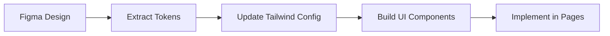

# Figma Import Guide for Recovery Tree

**Last Updated**: 2025-11-08
**Project**: Recovery Tree (Next.js 15 + React 18 + TailwindCSS)

This guide shows you how to import Figma designs into your existing codebase without adding extra dependencies or complexity.

---

## Table of Contents
1. [Overview](#overview)
2. [Quick Start Workflow](#quick-start-workflow)
3. [Step 1: Extract Design Tokens](#step-1-extract-design-tokens)
4. [Step 2: Update Tailwind Config](#step-2-update-tailwind-config)
5. [Step 3: Create Reusable UI Components](#step-3-create-reusable-ui-components)
6. [Step 4: Implement Figma Designs](#step-4-implement-figma-designs)
7. [Best Practices](#best-practices)
8. [Troubleshooting](#troubleshooting)

---

## Overview

**Why this approach?**
- ✅ No new dependencies (Plasmic, Anima, etc.)
- ✅ Full control over code quality
- ✅ TypeScript type safety
- ✅ Works with existing TailwindCSS setup
- ✅ Perfect for interactive components (timers, AI chat, forms)

**What you'll learn:**
- Extract colors, spacing, typography from Figma
- Convert Figma designs to TailwindCSS utilities
- Build a reusable component library
- Maintain design consistency

---

## Quick Start Workflow



**Time estimate**: 1-3 hours for initial setup, then 15-30 min per component

---

## Step 1: Extract Design Tokens

### 1.1 Colors

**In Figma:**
1. Open your Figma file
2. Check the **Local Styles** panel (right sidebar)
3. Look for color styles or inspect individual elements

**What to extract:**
```
Primary colors (buttons, links, CTAs)
Secondary colors (backgrounds, cards)
Semantic colors (success, error, warning, info)
Neutral colors (text, borders, backgrounds)
```

**Example extraction:**
```
Primary: #3B82F6
Secondary: #8B5CF6
Success: #10B981
Error: #EF4444
Warning: #F59E0B
Background: #FFFFFF
Background Dark: #1F2937
Text Primary: #111827
Text Secondary: #6B7280
Border: #E5E7EB
```

### 1.2 Typography

**In Figma:**
1. Select text elements
2. Check **Inspect panel** (right sidebar)
3. Note font family, size, weight, line height

**What to extract:**
```
Font families (primary, secondary, monospace)
Font sizes (heading levels, body, captions)
Font weights (regular, medium, semibold, bold)
Line heights
Letter spacing
```

**Example extraction:**
```
Font Family: Inter (or system-ui)
Heading 1: 36px, 700 weight, 1.2 line-height
Heading 2: 30px, 700 weight, 1.3 line-height
Heading 3: 24px, 600 weight, 1.4 line-height
Body: 16px, 400 weight, 1.5 line-height
Small: 14px, 400 weight, 1.5 line-height
```

### 1.3 Spacing

**In Figma:**
1. Select elements and check spacing between them
2. Look for Auto Layout padding/gap values
3. Note common spacing patterns

**Common Tailwind spacing scale:**
```
0.5 = 2px (0.125rem)
1   = 4px (0.25rem)
2   = 8px (0.5rem)
3   = 12px (0.75rem)
4   = 16px (1rem)
5   = 20px (1.25rem)
6   = 24px (1.5rem)
8   = 32px (2rem)
10  = 40px (2.5rem)
12  = 48px (3rem)
16  = 64px (4rem)
```

### 1.4 Shadows & Effects

**In Figma:**
1. Select elements with drop shadows
2. Check **Effects** in inspect panel
3. Note blur, spread, offset, opacity

**Example extraction:**
```
Card Shadow: 0px 1px 3px rgba(0,0,0,0.1), 0px 1px 2px rgba(0,0,0,0.06)
Button Shadow: 0px 1px 2px rgba(0,0,0,0.05)
Modal Shadow: 0px 20px 25px rgba(0,0,0,0.1), 0px 10px 10px rgba(0,0,0,0.04)
```

### 1.5 Border Radius

**In Figma:**
1. Select elements with rounded corners
2. Check **Corner radius** value

**Common values:**
```
Small: 4px (rounded-sm)
Medium: 6px (rounded-md)
Large: 8px (rounded-lg)
XLarge: 12px (rounded-xl)
Full: 9999px (rounded-full)
```

---

## Step 2: Update Tailwind Config

Open `/tailwind.config.ts` and add your extracted tokens.

### 2.1 Full Example Config

```typescript
import type { Config } from "tailwindcss";

const config: Config = {
  content: [
    "./pages/**/*.{js,ts,jsx,tsx,mdx}",
    "./components/**/*.{js,ts,jsx,tsx,mdx}",
    "./app/**/*.{js,ts,jsx,tsx,mdx}",
  ],
  theme: {
    extend: {
      // COLORS
      colors: {
        // Keep existing variables
        background: "var(--background)",
        foreground: "var(--foreground)",

        // Add your brand colors from Figma
        recovery: {
          primary: "#3B82F6",      // Main brand color
          secondary: "#8B5CF6",    // Secondary actions
          accent: "#10B981",       // Success/completion
        },

        // Semantic colors
        success: "#10B981",
        error: "#EF4444",
        warning: "#F59E0B",
        info: "#3B82F6",

        // Neutral scale (for text, borders, backgrounds)
        gray: {
          50: "#F9FAFB",
          100: "#F3F4F6",
          200: "#E5E7EB",
          300: "#D1D5DB",
          400: "#9CA3AF",
          500: "#6B7280",
          600: "#4B5563",
          700: "#374151",
          800: "#1F2937",
          900: "#111827",
        },
      },

      // TYPOGRAPHY
      fontFamily: {
        sans: ['Inter', 'system-ui', 'sans-serif'],
        // Add more if needed:
        // heading: ['Poppins', 'sans-serif'],
        // mono: ['JetBrains Mono', 'monospace'],
      },

      fontSize: {
        // Extend or override default sizes
        'xs': ['0.75rem', { lineHeight: '1rem' }],
        'sm': ['0.875rem', { lineHeight: '1.25rem' }],
        'base': ['1rem', { lineHeight: '1.5rem' }],
        'lg': ['1.125rem', { lineHeight: '1.75rem' }],
        'xl': ['1.25rem', { lineHeight: '1.75rem' }],
        '2xl': ['1.5rem', { lineHeight: '2rem' }],
        '3xl': ['1.875rem', { lineHeight: '2.25rem' }],
        '4xl': ['2.25rem', { lineHeight: '2.5rem' }],
        // Custom sizes from Figma
        'display': ['3rem', { lineHeight: '1.2', fontWeight: '700' }],
      },

      // SPACING (usually defaults are fine, but you can add custom)
      spacing: {
        '18': '4.5rem',  // 72px - if you need custom values
        '112': '28rem',   // 448px
      },

      // SHADOWS
      boxShadow: {
        'sm': '0 1px 2px 0 rgba(0, 0, 0, 0.05)',
        'DEFAULT': '0 1px 3px 0 rgba(0, 0, 0, 0.1), 0 1px 2px 0 rgba(0, 0, 0, 0.06)',
        'md': '0 4px 6px -1px rgba(0, 0, 0, 0.1), 0 2px 4px -1px rgba(0, 0, 0, 0.06)',
        'lg': '0 10px 15px -3px rgba(0, 0, 0, 0.1), 0 4px 6px -2px rgba(0, 0, 0, 0.05)',
        'xl': '0 20px 25px -5px rgba(0, 0, 0, 0.1), 0 10px 10px -5px rgba(0, 0, 0, 0.04)',
        // Custom from Figma
        'card': '0 1px 3px rgba(0,0,0,0.1), 0 1px 2px rgba(0,0,0,0.06)',
        'modal': '0 20px 25px rgba(0,0,0,0.1), 0 10px 10px rgba(0,0,0,0.04)',
      },

      // BORDER RADIUS
      borderRadius: {
        'sm': '0.25rem',   // 4px
        'DEFAULT': '0.375rem', // 6px
        'md': '0.375rem',  // 6px
        'lg': '0.5rem',    // 8px
        'xl': '0.75rem',   // 12px
        '2xl': '1rem',     // 16px
        'full': '9999px',
      },

      // ANIMATIONS (if needed)
      animation: {
        'fade-in': 'fadeIn 0.3s ease-in',
        'slide-up': 'slideUp 0.3s ease-out',
      },

      keyframes: {
        fadeIn: {
          '0%': { opacity: '0' },
          '100%': { opacity: '1' },
        },
        slideUp: {
          '0%': { transform: 'translateY(10px)', opacity: '0' },
          '100%': { transform: 'translateY(0)', opacity: '1' },
        },
      },
    },
  },
  plugins: [],
};

export default config;
```

### 2.2 Test Your Config

After updating, restart your dev server:
```bash
npm run dev
```

Test a color in any component:
```tsx
<div className="bg-recovery-primary text-white">
  Test
</div>
```

---

## Step 3: Create Reusable UI Components

Build a component library in `/components/ui/` to match your Figma design system.

### 3.1 Create UI Folder

```bash
mkdir -p components/ui
```

### 3.2 Button Component

**File**: `/components/ui/Button.tsx`

```tsx
import React from 'react';

export interface ButtonProps extends React.ButtonHTMLAttributes<HTMLButtonElement> {
  variant?: 'primary' | 'secondary' | 'outline' | 'ghost' | 'danger';
  size?: 'sm' | 'md' | 'lg';
  fullWidth?: boolean;
  isLoading?: boolean;
}

export function Button({
  variant = 'primary',
  size = 'md',
  fullWidth = false,
  isLoading = false,
  className = '',
  children,
  disabled,
  ...props
}: ButtonProps) {
  const baseStyles = 'font-medium rounded-lg transition-all duration-200 disabled:opacity-50 disabled:cursor-not-allowed';

  const variants = {
    primary: 'bg-recovery-primary text-white hover:bg-blue-600 shadow-sm',
    secondary: 'bg-recovery-secondary text-white hover:bg-purple-600 shadow-sm',
    outline: 'border-2 border-recovery-primary text-recovery-primary hover:bg-blue-50',
    ghost: 'text-recovery-primary hover:bg-blue-50',
    danger: 'bg-error text-white hover:bg-red-600 shadow-sm',
  };

  const sizes = {
    sm: 'px-3 py-1.5 text-sm',
    md: 'px-4 py-2 text-base',
    lg: 'px-6 py-3 text-lg',
  };

  const widthClass = fullWidth ? 'w-full' : '';

  return (
    <button
      className={`${baseStyles} ${variants[variant]} ${sizes[size]} ${widthClass} ${className}`}
      disabled={disabled || isLoading}
      {...props}
    >
      {isLoading ? (
        <span className="flex items-center justify-center gap-2">
          <svg className="animate-spin h-4 w-4" viewBox="0 0 24 24">
            <circle className="opacity-25" cx="12" cy="12" r="10" stroke="currentColor" strokeWidth="4" fill="none" />
            <path className="opacity-75" fill="currentColor" d="M4 12a8 8 0 018-8V0C5.373 0 0 5.373 0 12h4zm2 5.291A7.962 7.962 0 014 12H0c0 3.042 1.135 5.824 3 7.938l3-2.647z" />
          </svg>
          Loading...
        </span>
      ) : children}
    </button>
  );
}
```

**Usage example:**
```tsx
import { Button } from '@/components/ui/Button';

<Button variant="primary" size="md">Continue Walk</Button>
<Button variant="outline" size="sm">Cancel</Button>
<Button variant="danger" isLoading>Deleting...</Button>
```

### 3.3 Card Component

**File**: `/components/ui/Card.tsx`

```tsx
import React from 'react';

export interface CardProps {
  children: React.ReactNode;
  className?: string;
  padding?: 'sm' | 'md' | 'lg';
  shadow?: boolean;
  hoverable?: boolean;
}

export function Card({
  children,
  className = '',
  padding = 'md',
  shadow = true,
  hoverable = false,
}: CardProps) {
  const paddingStyles = {
    sm: 'p-3',
    md: 'p-4',
    lg: 'p-6',
  };

  const shadowClass = shadow ? 'shadow-card' : '';
  const hoverClass = hoverable ? 'hover:shadow-lg transition-shadow duration-200 cursor-pointer' : '';

  return (
    <div className={`bg-white rounded-lg ${paddingStyles[padding]} ${shadowClass} ${hoverClass} ${className}`}>
      {children}
    </div>
  );
}

export function CardHeader({ children, className = '' }: { children: React.ReactNode; className?: string }) {
  return <div className={`mb-4 ${className}`}>{children}</div>;
}

export function CardTitle({ children, className = '' }: { children: React.ReactNode; className?: string }) {
  return <h3 className={`text-xl font-semibold text-gray-900 ${className}`}>{children}</h3>;
}

export function CardContent({ children, className = '' }: { children: React.ReactNode; className?: string }) {
  return <div className={`text-gray-700 ${className}`}>{children}</div>;
}
```

**Usage example:**
```tsx
import { Card, CardHeader, CardTitle, CardContent } from '@/components/ui/Card';

<Card shadow hoverable>
  <CardHeader>
    <CardTitle>Daily Reflection</CardTitle>
  </CardHeader>
  <CardContent>
    <p>How are you feeling today?</p>
  </CardContent>
</Card>
```

### 3.4 Input Component

**File**: `/components/ui/Input.tsx`

```tsx
import React from 'react';

export interface InputProps extends React.InputHTMLAttributes<HTMLInputElement> {
  label?: string;
  error?: string;
  helperText?: string;
}

export function Input({
  label,
  error,
  helperText,
  className = '',
  ...props
}: InputProps) {
  const inputStyles = error
    ? 'border-error focus:ring-error focus:border-error'
    : 'border-gray-300 focus:ring-recovery-primary focus:border-recovery-primary';

  return (
    <div className="w-full">
      {label && (
        <label className="block text-sm font-medium text-gray-700 mb-1">
          {label}
        </label>
      )}

      <input
        className={`w-full px-3 py-2 border rounded-lg shadow-sm focus:outline-none focus:ring-2 transition-colors ${inputStyles} ${className}`}
        {...props}
      />

      {error && (
        <p className="mt-1 text-sm text-error">{error}</p>
      )}

      {helperText && !error && (
        <p className="mt-1 text-sm text-gray-500">{helperText}</p>
      )}
    </div>
  );
}
```

**Usage example:**
```tsx
import { Input } from '@/components/ui/Input';

<Input
  label="Email"
  type="email"
  placeholder="you@example.com"
  helperText="We'll never share your email"
/>

<Input
  label="Password"
  type="password"
  error="Password must be at least 8 characters"
/>
```

### 3.5 Badge Component

**File**: `/components/ui/Badge.tsx`

```tsx
import React from 'react';

export interface BadgeProps {
  children: React.ReactNode;
  variant?: 'default' | 'success' | 'warning' | 'error' | 'info';
  size?: 'sm' | 'md';
  className?: string;
}

export function Badge({
  children,
  variant = 'default',
  size = 'md',
  className = '',
}: BadgeProps) {
  const baseStyles = 'inline-flex items-center font-medium rounded-full';

  const variants = {
    default: 'bg-gray-100 text-gray-800',
    success: 'bg-green-100 text-green-800',
    warning: 'bg-yellow-100 text-yellow-800',
    error: 'bg-red-100 text-red-800',
    info: 'bg-blue-100 text-blue-800',
  };

  const sizes = {
    sm: 'px-2 py-0.5 text-xs',
    md: 'px-2.5 py-1 text-sm',
  };

  return (
    <span className={`${baseStyles} ${variants[variant]} ${sizes[size]} ${className}`}>
      {children}
    </span>
  );
}
```

### 3.6 Export All Components

**File**: `/components/ui/index.ts`

```tsx
export { Button } from './Button';
export type { ButtonProps } from './Button';

export { Card, CardHeader, CardTitle, CardContent } from './Card';
export type { CardProps } from './Card';

export { Input } from './Input';
export type { InputProps } from './Input';

export { Badge } from './Badge';
export type { BadgeProps } from './Badge';
```

Now you can import easily:
```tsx
import { Button, Card, Input, Badge } from '@/components/ui';
```

---

## Step 4: Implement Figma Designs

### 4.1 Workflow for Each Screen

1. **Open Figma and the file you want to implement**
2. **Select the frame/screen**
3. **Analyze the layout structure**:
   - Is it a grid, flex, or absolute positioning?
   - What are the spacing values?
   - What components are used?

4. **Build from top to bottom**:
   - Start with containers (page layout)
   - Add sections (header, main, footer)
   - Add cards/panels
   - Add individual components (buttons, inputs, text)

### 4.2 Example: Converting a Figma Card

**Figma specs:**
```
Background: White (#FFFFFF)
Border radius: 12px
Shadow: 0 1px 3px rgba(0,0,0,0.1)
Padding: 24px
Heading: 24px, Bold, #111827
Body text: 16px, Regular, #6B7280
Button: Primary style, 16px padding
```

**Implementation:**
```tsx
import { Card, CardHeader, CardTitle, CardContent } from '@/components/ui/Card';
import { Button } from '@/components/ui/Button';

export function WelcomeCard() {
  return (
    <Card padding="lg" shadow>
      <CardHeader>
        <CardTitle className="text-2xl">Welcome Back!</CardTitle>
      </CardHeader>
      <CardContent>
        <p className="text-gray-600 mb-4">
          Ready to continue your journey?
        </p>
        <Button variant="primary" fullWidth>
          Start Today's Walk
        </Button>
      </CardContent>
    </Card>
  );
}
```

### 4.3 Inspecting Figma Elements

**Key shortcuts in Figma:**
- **Select element** → Check right sidebar "Inspect" tab
- **Hold Option/Alt** → See spacing between elements
- **Copy CSS** → Right-click → "Copy as CSS" (then adapt to Tailwind)

**Mapping Figma to Tailwind:**

| Figma Property | Tailwind Class |
|----------------|----------------|
| Width: 100% | `w-full` |
| Padding: 16px | `p-4` |
| Margin top: 24px | `mt-6` |
| Gap: 8px | `gap-2` |
| Font size: 16px | `text-base` |
| Font weight: 600 | `font-semibold` |
| Border radius: 8px | `rounded-lg` |
| Flex direction: column | `flex flex-col` |
| Align items: center | `items-center` |
| Justify: space-between | `justify-between` |

### 4.4 Responsive Design

If your Figma has mobile/tablet/desktop breakpoints:

```tsx
{/* Mobile: Stack vertically, Desktop: Side by side */}
<div className="flex flex-col md:flex-row gap-4">
  <div className="w-full md:w-1/2">Column 1</div>
  <div className="w-full md:w-1/2">Column 2</div>
</div>

{/* Hide on mobile, show on desktop */}
<div className="hidden md:block">Desktop only content</div>

{/* Show on mobile, hide on desktop */}
<div className="block md:hidden">Mobile only content</div>
```

**Tailwind breakpoints:**
```
sm: 640px
md: 768px
lg: 1024px
xl: 1280px
2xl: 1536px
```

---

## Step 5: Export Assets from Figma

### 5.1 Icons and Images

**In Figma:**
1. Select the icon/image
2. Right-click → "Export..."
3. Choose format:
   - **SVG** for icons/logos (scalable, small file size)
   - **PNG** for photos (choose 2x or 3x for retina displays)
   - **WebP** for optimized photos (Next.js auto-converts)

4. Click "Export"

**Save to your project:**
```
/public/images/logo.svg
/public/icons/check.svg
/public/icons/arrow-right.svg
```

**Use in components:**
```tsx
import Image from 'next/image';

{/* For images */}
<Image
  src="/images/logo.svg"
  alt="Recovery Tree Logo"
  width={120}
  height={40}
/>

{/* For simple icons */}

```

### 5.2 Inline SVG Icons

For better control (color, size), copy SVG code directly:

**In Figma:**
1. Select icon → Right-click → "Copy as SVG"

**Create icon component:**
```tsx
export function CheckIcon({ className = "w-5 h-5" }: { className?: string }) {
  return (
    <svg className={className} viewBox="0 0 20 20" fill="currentColor">
      <path fillRule="evenodd" d="M16.707 5.293a1 1 0 010 1.414l-8 8a1 1 0 01-1.414 0l-4-4a1 1 0 011.414-1.414L8 12.586l7.293-7.293a1 1 0 011.414 0z" clipRule="evenodd" />
    </svg>
  );
}
```

**Usage:**
```tsx
<CheckIcon className="w-6 h-6 text-success" />
```

---

## Best Practices

### 1. Component Structure
```
components/
├── ui/              # Reusable design system components
│   ├── Button.tsx
│   ├── Card.tsx
│   ├── Input.tsx
│   └── index.ts
├── walk/            # Feature-specific components
│   ├── WalkSession.tsx
│   └── ...
└── layout/          # Layout components (if needed)
    ├── Header.tsx
    └── Footer.tsx
```

### 2. Naming Conventions
- **Components**: PascalCase (`Button`, `WalkSession`)
- **Props interfaces**: `ComponentNameProps` (`ButtonProps`)
- **Tailwind classes**: Use logical grouping
  ```tsx
  // Layout → Spacing → Colors → Typography → Effects
  className="flex items-center gap-4 px-6 py-3 bg-blue-500 text-white text-lg font-semibold rounded-lg shadow-md hover:bg-blue-600 transition-colors"
  ```

### 3. CSS Variables for Themes

If you need dark mode, use CSS variables:

**File**: `/app/globals.css`
```css
@layer base {
  :root {
    --color-primary: 59 130 246;     /* RGB for bg-primary */
    --color-secondary: 139 92 246;
  }

  .dark {
    --color-primary: 96 165 250;     /* Lighter for dark mode */
    --color-secondary: 167 139 250;
  }
}
```

**In Tailwind config:**
```typescript
colors: {
  primary: 'rgb(var(--color-primary) / <alpha-value>)',
}
```

### 4. Consistency Checklist
- [ ] All colors from Figma are in `tailwind.config.ts`
- [ ] Typography scale matches Figma text styles
- [ ] Spacing is consistent (use Tailwind's scale, not arbitrary values)
- [ ] Border radius values match Figma
- [ ] Shadows match Figma effects
- [ ] Components are reusable and typed with TypeScript

### 5. Performance Tips
- Use `next/image` for images (automatic optimization)
- Lazy load heavy components: `const Component = dynamic(() => import('./Component'))`
- Minimize custom CSS, prefer Tailwind utilities
- Use semantic HTML (`<button>`, `<nav>`, `<main>`, etc.)

---

## Troubleshooting

### Issue: Colors look different from Figma

**Solution:**
1. Check color format (Figma might use HSL, convert to HEX/RGB)
2. Ensure your monitor isn't applying color profiles
3. Export a screenshot from Figma and compare side-by-side
4. Check for opacity/transparency differences

### Issue: Spacing doesn't match exactly

**Solution:**
1. Use Figma's measurement tool (hold Option/Alt)
2. Remember Tailwind spacing: `1 unit = 0.25rem = 4px`
3. For odd values (like 18px), add custom spacing to Tailwind config:
   ```typescript
   spacing: {
     '18': '4.5rem', // 72px
   }
   ```
4. Or use arbitrary values: `px-[18px]` (not recommended for consistency)

### Issue: Fonts look different

**Solutions:**
1. **Check if font is imported:**
   - If using Google Fonts, add to `/app/layout.tsx`:
     ```tsx
     import { Inter } from 'next/font/google';
     const inter = Inter({ subsets: ['latin'] });
     ```
   - Apply to body: `<body className={inter.className}>`

2. **Check font weight:**
   - Figma: 600 → Tailwind: `font-semibold`
   - Figma: 700 → Tailwind: `font-bold`

3. **Check line height:**
   - Figma: 150% → Tailwind: `leading-normal` (1.5)

### Issue: Shadows don't match

**Solution:**
Add exact shadow from Figma to Tailwind config:
```typescript
boxShadow: {
  'figma-card': '0px 1px 3px rgba(0, 0, 0, 0.1), 0px 1px 2px rgba(0, 0, 0, 0.06)',
}
```

Then use: `shadow-figma-card`

### Issue: Component looks pixelated on retina displays

**Solution:**
Export images at 2x or 3x resolution from Figma, or use SVG for sharp rendering at any size.

---

## Quick Reference

### Figma → Tailwind Cheat Sheet

```
LAYOUT
-----------------
Auto Layout (Horizontal) → flex flex-row
Auto Layout (Vertical)   → flex flex-col
Gap: 16px                → gap-4
Padding: 24px            → p-6
Align items: center      → items-center

SIZING
-----------------
Width: 100%              → w-full
Height: 100%             → h-full
Max width: 1200px        → max-w-screen-xl
Min height: 100vh        → min-h-screen

COLORS
-----------------
Fill: #3B82F6            → bg-blue-500
Text: #111827            → text-gray-900
Border: #E5E7EB          → border-gray-200

TYPOGRAPHY
-----------------
Font size: 24px          → text-2xl
Font weight: 600         → font-semibold
Line height: 1.5         → leading-normal
Text align: center       → text-center

EFFECTS
-----------------
Border radius: 8px       → rounded-lg
Opacity: 50%             → opacity-50
Shadow                   → shadow-lg
```

---

## Next Steps

1. **Extract tokens from your Figma file** (Step 1)
2. **Update your `tailwind.config.ts`** (Step 2)
3. **Build UI components library** (Step 3)
4. **Start implementing screens** (Step 4)

**Need help?** Open an issue in the repository or ask in the team chat.

---

**Pro tip**: Bookmark Tailwind docs for quick reference:
- [Colors](https://tailwindcss.com/docs/customizing-colors)
- [Spacing](https://tailwindcss.com/docs/customizing-spacing)
- [Typography](https://tailwindcss.com/docs/font-size)
- [Flexbox](https://tailwindcss.com/docs/flex)
